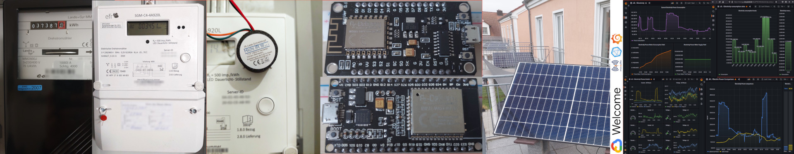

[Jochen Bürkle](https://www.linkedin.com/in/jochen-b%C3%BCrkle-ab694720/) berichtete uns von seinem Projekt, bei dem er kostengünstig detaillierte Daten zum Stromverbrauch und Erzeugung durch Solar-Balkonkraftwerke mittels IoT-Devices ausliest, in der Cloud aufbereitet und darstellt.

Jochens Folien, mit allem was man reproduzieren braucht, findet Ihr [hier](https://github.com/jug-in/jug-in.talks/raw/master/3rd/Energiewende_IoT-v20210112.pdf).

Vielen Dank für das tolle Projekte, die ausführliche Rechere und die anschauliche Aufbereitung.

