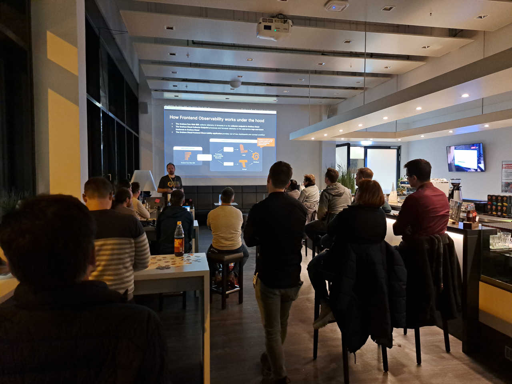

_Unsere erste hybrid-Veranstaltung; hat wunderbar funktioniert, Technik-sei-Dank._

Sebastian Schubert aus den Grafana Labs startete mit uns in das (ggf. unerforschte) Grafana OpenSource Universum:

_Open source is at the heart of what we do at Grafana Labs and there is so much happening! The intent of this talk is to update everyone on the latest development when it comes to Grafana, Pyroscope, Faro, Loki, Mimir, Tempo and more. Everyone has had at least heard about Grafana but maybe some of the other projects mentioned above are new to you? Welcome to this talk 😉_

Der Vortrag dauerte ca. 60 Minuten, anschließend gabe es scharfe Diskussionen und hitzige Pizza... oder wars andersrum? 🤔

Sebastians Folien findet Ihr [hier](https://github.com/jug-in/jug-in.talks/blob/master/3rd/JUG_Ingolstadt_-_Grafanas_Open_Source_Products.pdf)

---
